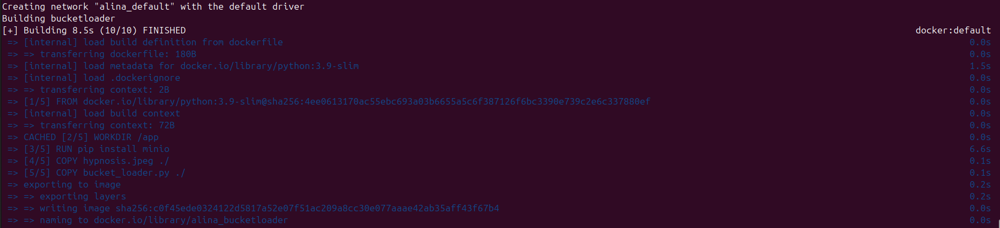
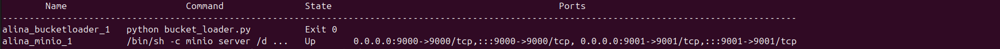
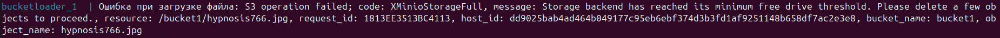

# Инструкция по запуску

1. Запустим контейнеры

```bash
docker-compose up -d
```




2. Проверим, что контейнеры запустились и отработали

```bash
docker-compose ps
```




3. Посмотрим логи контейнера загрузчика

```bash
docker-compose logs bucketloader
```




4. Видим ошибку, что хранилище переполнилось
